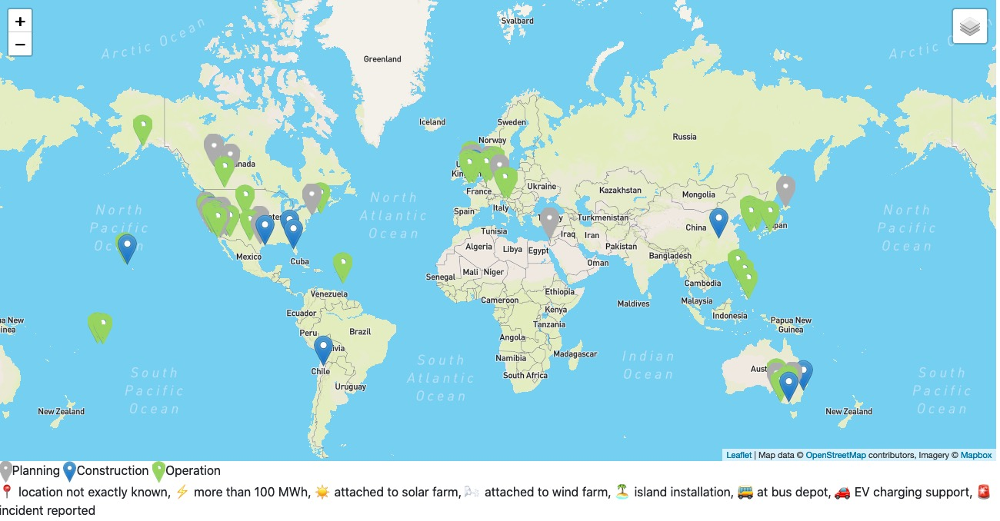

Table of Contents:
- [tesla-megapack-tracker](#tesla-megapack-tracker)
- [project structure](#project-structure)
- [good information sources](#good-information-sources)
- [for profit usage](#for-profit-usage)
- [want to contribute?](#want-to-contribute)
- [changelog](#changelog)
- [inspiration](#inspiration)
- [useful gpt prompts](#useful-gpt-prompts)

# tesla-megapack-tracker

- project tries to track all tesla megapack (>10MWh) installations and other big batteries where government data sources are available (>10MWh or 10MW)
- the site is hosted via github pages and this is the link:
  - 🟢 👉 https://lorenz-g.github.io/tesla-megapack-tracker/ 👈 🟢



# project structure

for now:
- raw data (tesla and other manufacturers) are in [projects.csv](./projects.csv) file
- the generated website is in the [docs](./docs) folder (it is called docs because of github pages)
- To generate the website, install the dependencies with `pip install -r requirements.txt` and run `python generate/website.py`. It is recommended to setup a python virtualenv for the project beforehand (can use `pip install pip-tools` and `pip-compile requirements.in` to create an up to date version of requirements)
  - all python code lives in the `generate` folder
- To develop it is handy to use a tool like [watchexec](https://watchexec.github.io/downloads/) to listen to file changes and then rebuild the site. Some handy commands are in the [./Makefile](./Makefile)
- to edit the CSV files, it is best to use Libre Office
- the external government data is the `misc` folder
- the blog entries are written in Markdown and in the `misc`

eventually:
- every battery installation has a toml file located in the `battery-projects`
- in case there are multiple stages to a project, they will be in that file
- the naming of the toml file is `date_id_project-name`, e.g. `2020-01-01_4_first-megapack-project`

for the cars vs stationary:
- raw data is in the [cars-vs-stationary.csv](./cars-vs-stationary.csv) file
- using the vehicle production numbers (from the tesla quarterly press releases)
- estimating the avg model 3/y battery with 60kWh and the model s/x with 90kwh
  - in the future could also add a new column use a more precise estimate per quarter, but fine for now.

# good information sources

This has grown, so you can find it here now: [Big Battery Info Sources](./misc/2021-11-19-big-battery-info-sources.md)

# for profit usage

- if you are a corporate and can use some the data here please do. You can also sell it on (but please respect the MIT license to give credit where it's due)
- and if you have used it, please consider contributing some info/insights back to the project via pull requests. Thanks 👏

# want to contribute?

- battery projects
  - just add them to the `projects.csv` file and submit a PR (Pull Request)
- feature / website improvements
  - there is a [TODO](./misc/TODO.md) file. You can just grab sth there. 
- new government integration
  - they are the best to keep data up to date. Feel free to add one. 
- blog post
  - just write / amend one and submit a PR. 

# changelog

- you can find the changelog file here: [./misc/2021-08-30-changelog.md](./misc/2021-08-30-changelog.md)
- not everything is documented here. The git commit history should be more complete.


# inspiration

There are many other great trackers about various tesla stats, such as:
  - Tesla Carriers tracker https://fmossott.github.io/TeslaCarriersMap/
  - Norway car registration tracker https://elbilstatistikk.no/
  - Model 3 VIN tracker (not active anymore) https://www.model3vins.com/ 
  - Power tracker of big batteries in Australia: http://nemlog.com.au/show/unit/yesterday/?k1=VBBG1,VBBL1 
  - EU EVs tracker https://eu-evs.com/ 
  - https://map.evuniverse.io/#mapstart map of EV the ev industry

# useful gpt prompts 

- to help find recent megapack projects that I might have missed. 

```
Can you give me an overview of the tesla megapack projects that have been announced or completed since october 2024. 
Please list them in a table with project name, country, state, mw, mwh, date_accounced, date_go_live and the data source
```
